# Mednet-EMS ( Employee Management System )
A simple web-based Employee Management System built using **Spring MVC**, **Hibernate**, **JSP**, and **MySQL**.  
This project was developed as part of a technical task assigned by **Oakland Systems Pvt. Ltd. (Mednet Labs)**.

---

## 🚀 Version 3.0 Enhancements

### ✨ New Features

* Added **Print Employee Details** functionality
* Implemented a new, clean, and responsive UI
* Created separate CSS files for each view page
* Introduced Service Layer for better modularity
* Improved implementation class structure
* Enhanced overall user experience

---

### 🛠️ Bug Fixes & Improvements

* Fixed Password and Confirm Password validation issues
* Added duplicate Login ID validation and warning
* Secured APIs to allow access only for authenticated users
* Improved code readability and maintainability
* Optimized Controller → Service → DAO workflow

---

### 🏗️ Architecture Improvements

* Implemented layered architecture:

  * Controller Layer
  * Service Layer
  * DAO Layer
  * Repository Layer
  * Entity Layer
* Follows industry-standard MVC design pattern
* Improves scalability and long-term maintenance

---

## 📌 Project Objective

To create a basic web application that allows:
- Employee registration
- Employee login
- Displaying a welcome page with the logged-in employee’s name
- Viewing a list of all registered employees
- Persisting employee data in a MySQL database

---

## 🛠️ Technologies Used

- **Java 11**
- **Spring MVC**
- **Hibernate ORM**
- **JSP**
- **MySQL**
- **Apache Tomcat 9**
- **Maven**
- **Eclipse IDE**

---

## 📂 Project Structure

```
Mednet-EMS
│
├── screenshots
│   ├── controller-1.png
│   ├── controller-2.png
│   ├── controller-3.png
│   ├── dao.png
│   ├── db-users.png
│   ├── db-users-2.png
│   ├── Delete_Confirmation.jpg
│   ├── entity.png
│   ├── hibernate-cfg.png
│   ├── Home_Page.jpeg
│   ├── Login_Page.jpeg
│   ├── login-jsp.png
│   ├── Print_Page.jpg
│   ├── Registration_Page.jpeg
│   ├── repository.png
│   ├── Update_Emp_Page.jpeg
│   └── Welcome_Page.jpeg
│
├── src
│   └── main
│       ├── java
│       │   └── com
│       │       └── rush
│       │           ├── controller
│       │           │   └── EmployeeController.java
│       │           │
│       │           ├── service
│       │           │   ├── EmployeeService.java
│       │           │   └── EmployeeServiceImpl.java
│       │           │
│       │           ├── dao
│       │           │   ├── EmployeeDAO.java
│       │           │   └── EmployeeDAOImpl.java
│       │           │
│       │           ├── repo
│       │           │   └── HibernateConn.java
│       │           │
│       │           └── entity
│       │               └── Employee.java
│       │
│       ├── resources
│       │   └── hibernate.cfg.xml
│       │
│       └── webapp
│           ├── META-INF
│           │
│           ├── resources
│           │   └── css
│           │       ├── allEmployee.css
│           │       ├── index.css
│           │       ├── login.css
│           │       └── register.css
│           │
│           └── WEB-INF
│               ├── lib
│               │
│               ├── views
│               │   ├── allEmployee.jsp
│               │   ├── editEmployee.jsp
│               │   ├── index.jsp
│               │   ├── login.jsp
│               │   ├── printEmployee.jsp
│               │   └── register.jsp
│               │
│               ├── mednetems-servlet.xml
│               └── web.xml
│
├── target
├── pom.xml
└── README.md

````

---

## 🧾 Features Implemented (Version 3.0)

### ✅ Core Features

### 1️⃣ Employee Registration

* Captures employee details:

  * Name
  * Date of Birth
  * Gender
  * Address
  * City
  * State
  * Login ID
  * Password
  * Confirm Password
* Stores employee information securely in MySQL using Hibernate
* Prevents duplicate Login IDs

---

### 2️⃣ Authentication & Login

* Login using **Login ID and Password**
* Validates credentials from database
* Session-based authentication
* Restricted access for unauthorized users

---

### 3️⃣ Dashboard / Welcome Page

* Displays:

  * Personalized welcome message
  * Logged-in employee name
  * List of all registered employees
* Protected using session validation
* Prevents direct URL access without login

---

### 4️⃣ Employee Management (CRUD)

* View all employees
* Update employee details
* Delete employee records with confirmation
* All changes are synchronized with the database

---

### 5️⃣ Print Employee Details 🖨️

* Allows users to print employee information
* Generates printer-friendly layout
* Improves documentation and record keeping

---

### 6️⃣ Secure Logout

* Terminates user session
* Prevents back-navigation after logout
* Protects application data

---

## 🗄️ Database Details

**Database:** MySQL  
**Table:** `employees`

### Sample Table Structure

```sql
CREATE TABLE employees (
  id INT PRIMARY KEY AUTO_INCREMENT,
  name VARCHAR(100),
  dob DATE,
  gender VARCHAR(10),
  address VARCHAR(255),
  city VARCHAR(50),
  state VARCHAR(50),
  loginId VARCHAR(50) UNIQUE,
  password VARCHAR(100)
);
````

---

## ▶️ How to Run the Project

1. Import the project into **Eclipse** as a **Maven Project**
2. Configure MySQL database and update credentials in `hibernate.cfg.xml`
3. Deploy the project on **Apache Tomcat 9**
4. Open browser and visit:

   ```
   http://localhost:1234/Mednet-EMS/
   ```

---

## 📸 Screenshots 

The following screenshots are provided as part of the submission:

### 1️⃣ Employee Registration Page
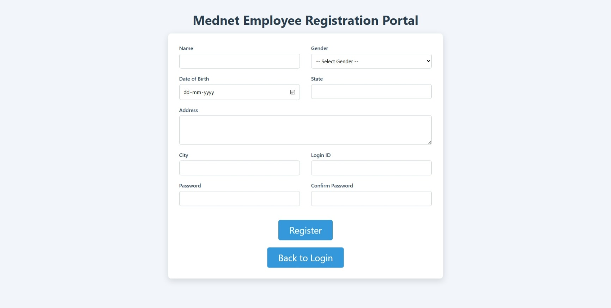

### 2️⃣ Login Page
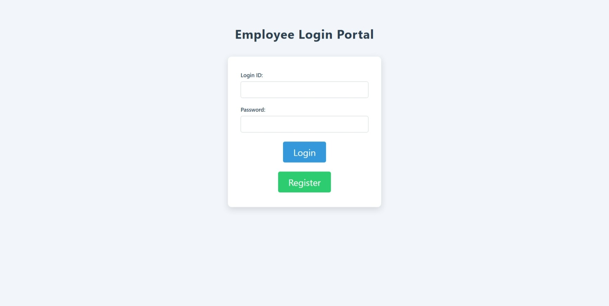

### 3️⃣ Welcome Page (Employee List)
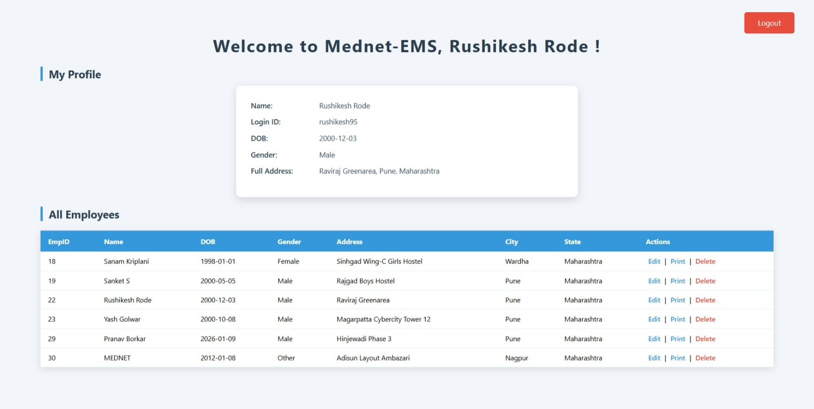

### 4️⃣ Database – Employees Table
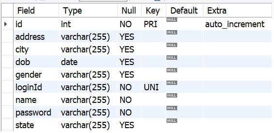
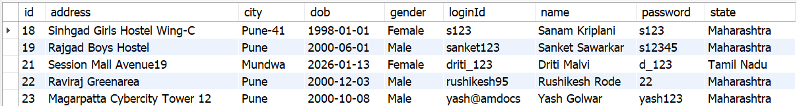

---

### 5️⃣ Code Screenshots

#### 5.1 Entity (Model)
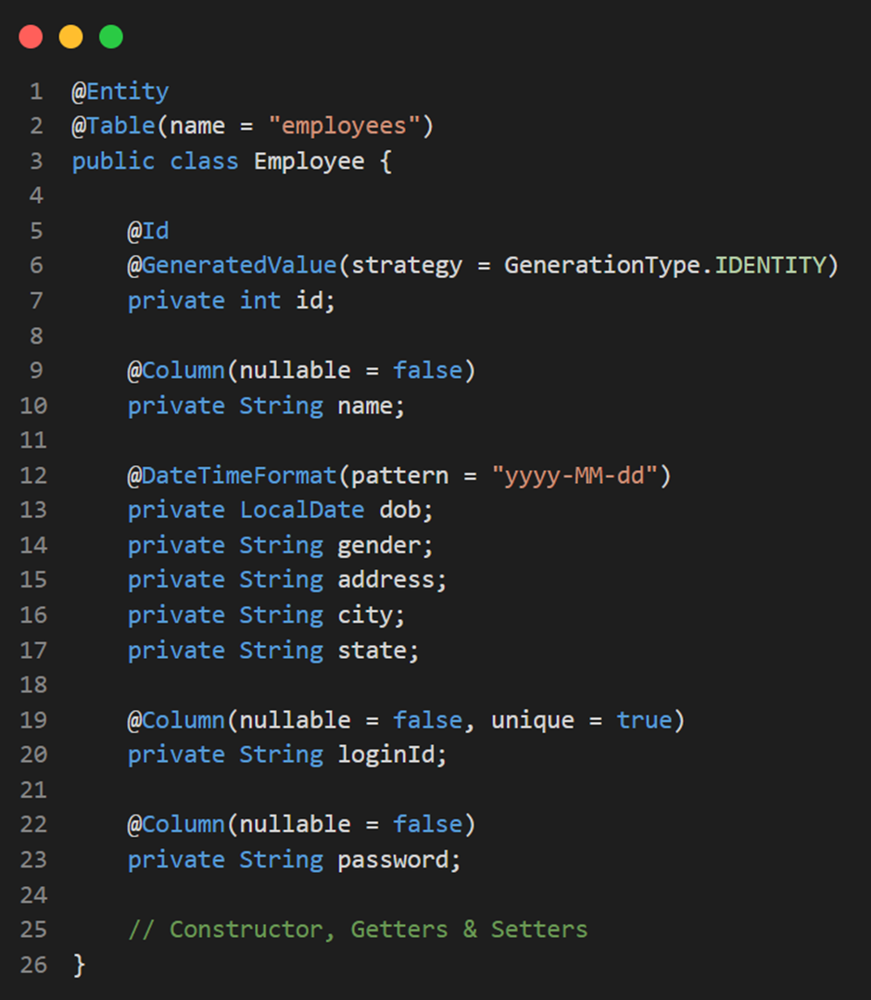

#### 5.2 Controller Layer
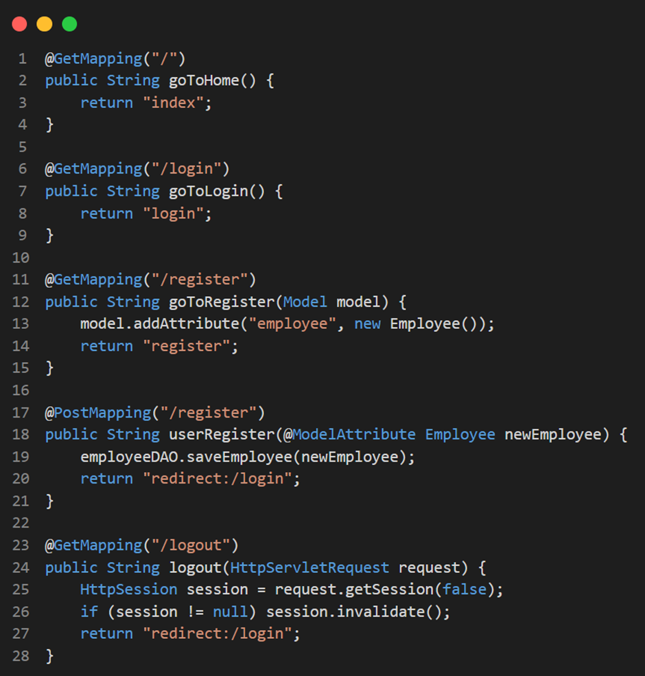
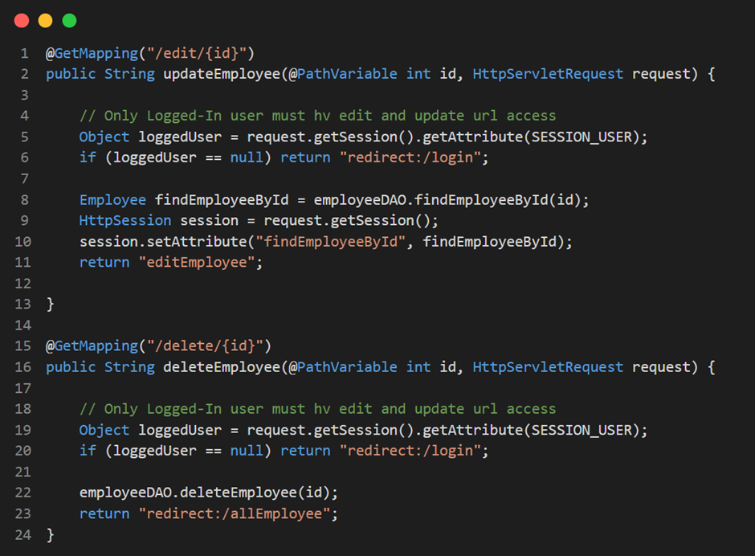

#### 5.3 DAO / Service Layer
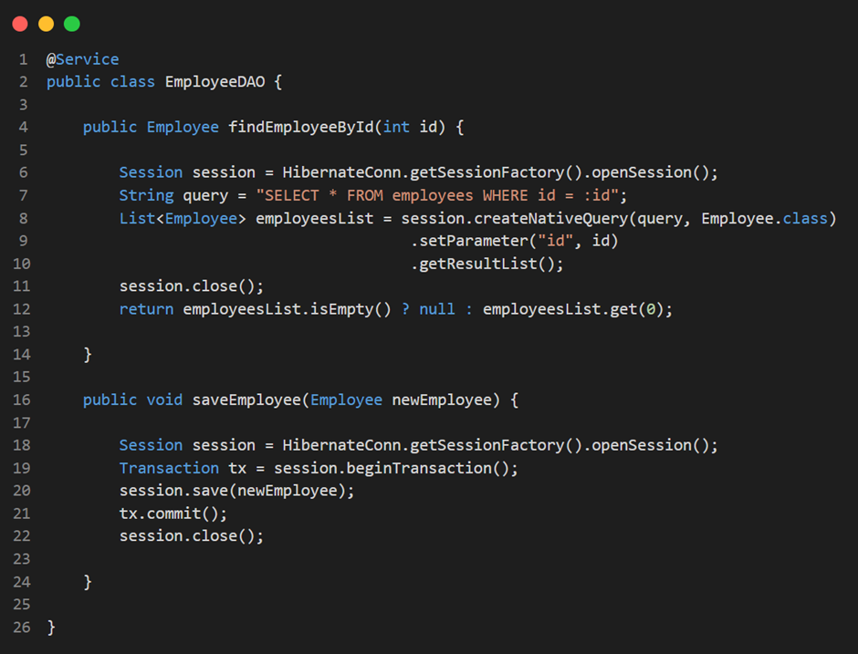

#### 5.4 Repository Layer


#### 5.5 Hibernate Configuration
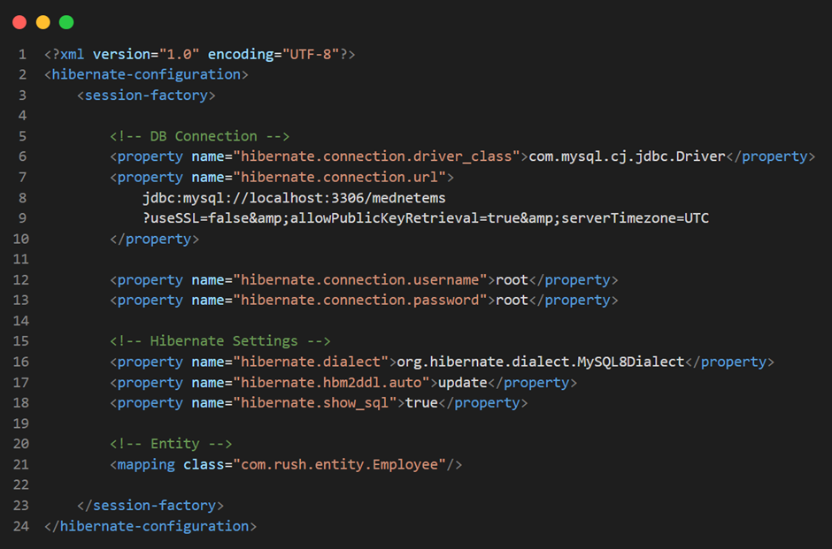

#### 5.6 Login JSP
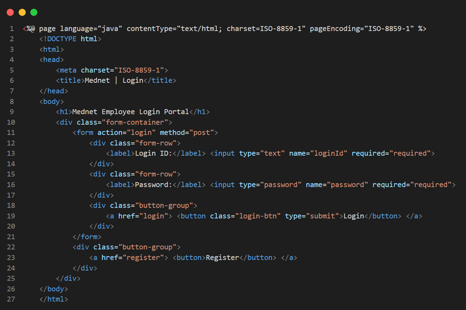

---

## 👤 Developer

- **Name:** Rushikesh Rode
- **Role:** Java Developer Trainee 
- **Project:** Technical Task – Oakland Systems Pvt. Ltd. (Mednet Labs)

---

## ✅ Conclusion

This project fulfills all the requirements mentioned in the task:

* Uses only allowed tools
* Implements Spring MVC + Hibernate
* Demonstrates CRUD operations
* Shows proper session handling and authentication

---

## 👤 Author

**RUSHIKESH RODE**  
📧 Email: rushikeshrode01@gmail.com  
💼 LinkedIn: [Rushikesh Rode](https://www.linkedin.com/in/rushikesh-rode-097572312)  
💻 GitHub: [Rushikesh Rode](https://github.com/rushikeshrode)  
🌐 Portfolio: [Rushikesh Rode](https://rushikeshrode.github.io/Rushikesh-s-Portfolio/)   
📍 Location: Pune, India
