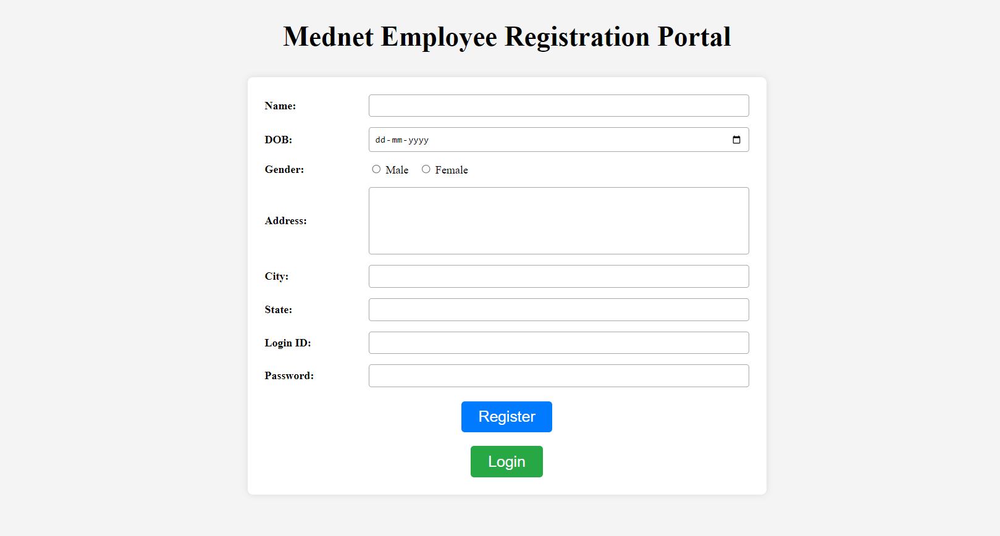
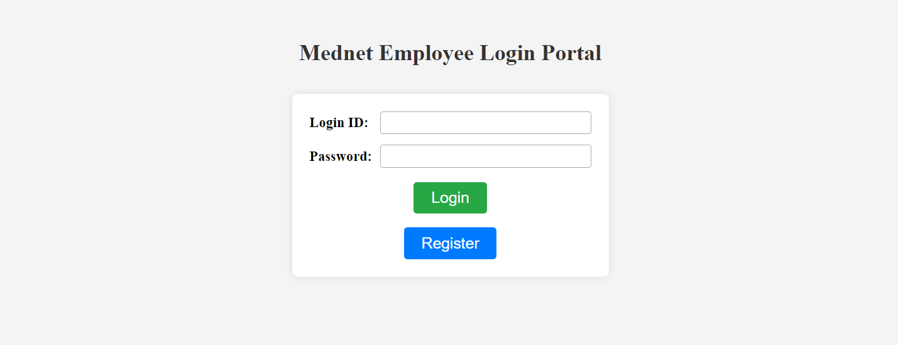
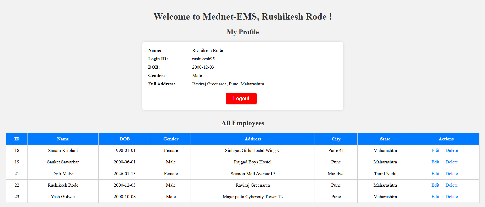

# Mednet-EMS ( Employee Management System )
A simple web-based Employee Management System built using **Spring MVC**, **Hibernate**, **JSP**, and **MySQL**.  
This project was developed as part of a technical task assigned by **Oakland Systems Pvt. Ltd. (Mednet Labs)**.

---

## 📌 Project Objective

To create a basic web application that allows:
- Employee registration
- Employee login
- Displaying a welcome page with the logged-in employee’s name
- Viewing a list of all registered employees
- Persisting employee data in a MySQL database

---

## 🛠️ Technologies Used

- **Java 11**
- **Spring MVC**
- **Hibernate ORM**
- **JSP**
- **MySQL**
- **Apache Tomcat 9**
- **Maven**
- **Eclipse IDE**

---

## 📂 Project Structure

```

Mednet-EMS
│
├── screenshots
│   ├── registration.png
│   ├── login.png
│   ├── welcome.png
│   ├── db-users.png
│   ├── entity.png
│   ├── controller-1.png
│   ├── controller-2.png
│   ├── dao.png
│   ├── repository.png
│   ├── hibernate-cfg.png
│   └── login-jsp.png
│
├── src
│   └── main
│       ├── java
│       │   └── com
│       │       └── rush
│       │           ├── controller
│       │           │   └── EmployeeController.java
│       │           ├── dao
│       │           │   └── EmployeeDAO.java
│       │           ├── entity
│       │           │   └── Employee.java
│       │           └── repo
│       │               └── HibernateConn.java
│       │
│       ├── resources
│       │   └── hibernate.cfg.xml
│       │
│       └── webapp
│           ├── META-INF
│           └── WEB-INF
│               ├── views
│               │   ├── index.jsp
│               │   ├── register.jsp
│               │   ├── login.jsp
│               │   ├── allEmployee.jsp
│               │   └── editEmployee.jsp
│               ├── web.xml
│               └── mednetems-servlet.xml
│
├── pom.xml
└── README.md


````

---

## 🧾 Features Implemented

### 1️: Employee Registration
- Fields:
  - Name
  - Date of Birth
  - Gender
  - Address
  - City
  - State
  - Login ID
  - Password
- Saves employee details into MySQL using Hibernate

---

### 2️: Login Functionality
- Login using **Login ID & Password**
- Validates credentials from database
- Creates session on successful login

---

### 3️: Welcome Page
- Displays:
  - Welcome message with logged-in employee name
  - List of all registered employees
- Session-based access control
- Direct URL access is restricted without login

---

### 4️: Employee Update & Delete
- Update employee details
- Delete employee records
- Changes are reflected in the database

---

### 5️: Logout
- Invalidates session
- Prevents access to protected pages after logout

---

## 🗄️ Database Details

**Database:** MySQL  
**Table:** `employees`

### Sample Table Structure

```sql
CREATE TABLE employees (
  id INT PRIMARY KEY AUTO_INCREMENT,
  name VARCHAR(100),
  dob DATE,
  gender VARCHAR(10),
  address VARCHAR(255),
  city VARCHAR(50),
  state VARCHAR(50),
  loginId VARCHAR(50) UNIQUE,
  password VARCHAR(100)
);
````

---

## ▶️ How to Run the Project

1. Import the project into **Eclipse** as a **Maven Project**
2. Configure MySQL database and update credentials in `hibernate.cfg.xml`
3. Deploy the project on **Apache Tomcat 9**
4. Open browser and visit:

   ```
   http://localhost:1234/Mednet-EMS/
   ```

---

## 📸 Screenshots 

The following screenshots are provided as part of the submission:

### 1️⃣ Employee Registration Page


### 2️⃣ Login Page


### 3️⃣ Welcome Page (Employee List)


### 4️⃣ Database – Employees Table


---

### 5️⃣ Code Screenshots

#### 5.1 Entity (Model)


#### 5.2 Controller Layer


#### 5.3 DAO / Service Layer


#### 5.4 Repository Layer


#### 5.5 Hibernate Configuration


#### 5.6 Login JSP


---

## 👤 Developer

- **Name:** Rushikesh Rode
- **Role:** Java Developer Trainee 
- **Project:** Technical Task – Oakland Systems Pvt. Ltd. (Mednet Labs)

---

## ✅ Conclusion

This project fulfills all the requirements mentioned in the task:

* Uses only allowed tools
* Implements Spring MVC + Hibernate
* Demonstrates CRUD operations
* Shows proper session handling and authentication

---

## 👤 Author

**RUSHIKESH RODE**  
📧 Email: rushikeshrode01@gmail.com  
💼 LinkedIn: [Rushikesh Rode](https://www.linkedin.com/in/rushikesh-rode-097572312)  
💻 GitHub: [Rushikesh Rode](https://github.com/rushikeshrode)  
🌐 Portfolio: [Rushikesh Rode](https://rushikeshrode.github.io/Rushikesh-s-Portfolio/)   
📍 Location: Pune, India
